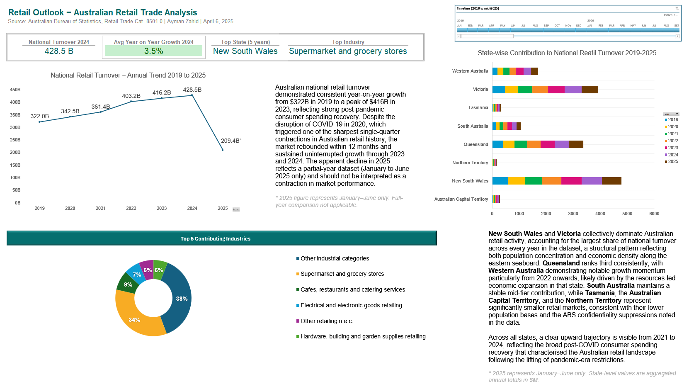
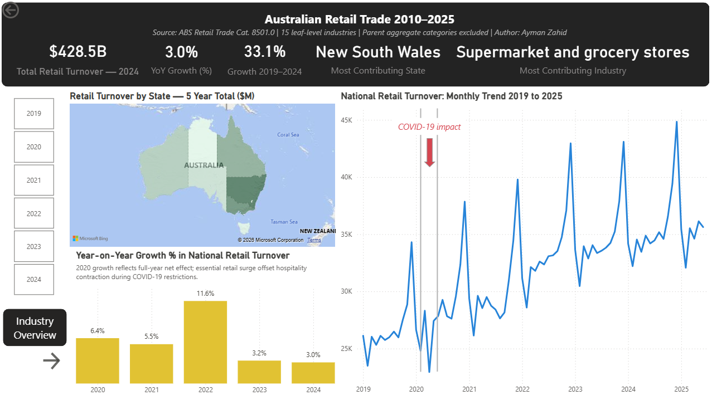

# Retail Trade Outlook — Australian Retail Market Analysis

**An end-to-end data analytics project** analysing Australian retail trade turnover
across 8 states, 15 industry categories, and 15+ years of ABS data — delivering
actionable market intelligence through PostgreSQL, Microsoft Excel, and Power BI.

---

## Table of Contents

- [Project Overview](#project-overview)
- [Tools and Technologies](#tools-and-technologies)
- [Project Structure](#project-structure)
- [Data Source](#data-source)
- [Methodology](#methodology)
- [SQL Pipeline](#sql-pipeline)
- [Excel Analysis](#excel-analysis)
- [Power BI Dashboard](#power-bi-dashboard)
- [Key Findings](#key-findings)
- [Methodological Notes](#methodological-notes)
- [Author](#author)

---

## Project Overview

This project delivers a comprehensive analysis of Australian retail trade turnover
using publicly available data from the **Australian Bureau of Statistics (ABS)**,
covering the period **January 2010 to June 2025**. The analysis spans the full
analytics pipeline — from raw data ingestion and relational database construction
through exploratory Excel analysis to an interactive two-page Power BI dashboard.

The project was designed to demonstrate practical, employer-ready data analytics
competency relevant to the Australian market, with deliberate emphasis on data
quality, methodological rigour, and business-level insight communication.

**Business questions answered:**
- How has Australian national retail turnover trended over 6 years (2019–2025)?
- Which states and industries are the dominant contributors to national turnover?
- What was the measurable impact of COVID-19 on Australian retail, and how quickly did the market recover?
- Which industries drive the majority of retail economic activity (Pareto analysis)?
- What is the current growth trajectory heading into 2025?

---

## Tools and Technologies

| Tool | Version | Purpose |
|------|---------|---------|
| PostgreSQL | 18 | Data ingestion, staging, cleaning, transformation, and analytical queries |
| Microsoft Excel | 365 | Exploratory analysis, pivot tables, KPI dashboard, dynamic formulas, sparklines |
| Power BI Desktop | 2025 | Two-page interactive dashboard with DAX measures, map visual, Pareto analysis |
| GitHub | — | Version control and portfolio documentation |

---

## Project Structure

```
retail-trade-outlook/
│
├── data/
│   ├── abs_retail_trade.csv           # Cleaned source data (Excel Power Query output)
│   ├── state_summary.csv              # State-level turnover aggregates (SQL export)
│   ├── industry_rank.csv              # Industry ranking by total turnover (SQL export)
│   ├── yoy_growth.csv                 # Monthly YoY growth per state & industry (SQL export)
│   └── monthly_trend.csv              # National monthly trend aggregates (SQL export)
│
├── sql/
│   └── retail_outlook_analysis.sql    # Fully annotated end-to-end SQL pipeline
│
├── excel/
│   └── retail_outlook_analysis.xlsx   # Excel workbook with pivot tables and KPI dashboard
│
├── powerbi/
│   ├── retail_outlook_dashboard.pbix  # Power BI Desktop source file
│   └── retail_outlook_dashboard.pdf   # Exported two-page dashboard (PDF)
│
├── images/
│   ├── excel_dashboard_preview.png    # Excel KPI dashboard screenshot
│   ├── powerbi_dashboard_pg1.png      # Power BI — National Retail Trade Outlook page
│   └── powerbi_dashboard_pg2.png      # Power BI — Industry-level Insights page
│
└── README.md
```

---

## Data Source

**Australian Bureau of Statistics (ABS)**
Retail Trade, Catalogue 8501.0 — Table 11
Monthly retail turnover by state and industry (seasonally adjusted)
Period: January 2010 – June 2025

Source data is freely available at:
https://www.abs.gov.au/statistics/industry/retail-and-wholesale-trade/retail-trade-australia/jun-2025

The ABS Retail Trade dataset is the primary reference for Australian retail
economic performance, used by the Reserve Bank of Australia, Treasury, and
major financial institutions as a leading indicator of consumer spending conditions.

---

## Methodology

### ETL Pipeline

Raw ABS data was downloaded as a wide-format CSV with metadata header rows
and industry categories as columns. The following ETL steps were performed
before SQL ingestion:

1. **Metadata removal** — Rows 1–11 (Unit, Series Type, Data Type, Frequency, Collection Month fields) were deleted, retaining only the data header row.
2. **Unpivoting** — Microsoft Excel Power Query was used to unpivot all industry columns into a long-format structure with four fields: `reporting_date`, `state`, `industry`, `turnover_millions`.
3. **Null exclusion** — Empty cells arising from ABS confidentiality suppression of low-volume markets were automatically dropped during unpivoting, preventing zero-inflation of downstream aggregations.
4. **Date formatting** — The `reporting_date` column was confirmed in `DD/MM/YYYY` format consistent with Australian locale settings, handled explicitly in the PostgreSQL `TO_DATE()` function.
5. **CSV export** — The cleaned dataset was exported as UTF-8 CSV for PostgreSQL ingestion.

### Hierarchical Double-Counting Correction

The ABS classification structure includes both granular leaf-level industry rows
**and** their parent aggregate category rows within the same dataset. Including
both in SUM aggregations produces inflated totals — a non-obvious data quality
issue requiring domain knowledge of the ABS taxonomy to identify and correct.

The following five parent categories were identified and excluded from all
aggregation queries using a `NOT IN` filter:

| Excluded Parent Category | Sub-categories it contains |
|--------------------------|---------------------------|
| Food retailing | Supermarket and grocery stores, Liquor retailing, Other specialised food retailing |
| Household goods retailing | Furniture/floor coverings, Electrical and electronic goods, Hardware and garden supplies |
| Clothing, footwear and personal accessory retailing | Clothing retailing, Footwear and other personal accessory retailing |
| Other retailing | Newspaper and book, Recreational goods, Pharmaceutical and cosmetic, Other retailing n.e.c., Department stores |
| Cafes, restaurants and takeaway food services | Cafes, restaurants and catering services, Takeaway food services |

This correction reduced the reported 2024 national turnover figure from an
inflated ~$841B to an accurate $428.5B, consistent with independently
published ABS annual totals.

---

## SQL Pipeline

**File:** `sql/retail_outlook_analysis.sql`

The SQL script executes a six-stage analytical pipeline in PostgreSQL 18,
progressing from raw data ingestion through to four analysis-ready result sets
used by both the Excel workbook and Power BI dashboard.

### Stage 1 — Staging table

Raw CSV imported into `retail_raw` with all columns typed as `TEXT` to
prevent type-mismatch errors at import. Numeric casting is deliberately
deferred to Stage 2 to ensure clean, controlled transformation.

```sql
CREATE TABLE retail_raw (
    reporting_date    TEXT,
    state             TEXT,
    industry          TEXT,
    turnover_millions NUMERIC
);
```

### Stage 2 — Data cleaning and production table

`retail_clean` created with full type casting, date decomposition, and
whitespace normalisation applied in a single `CREATE TABLE AS SELECT` statement:

- `TO_DATE()` casting of the reporting date with explicit `DD/MM/YYYY` format consistent with Australian locale
- `EXTRACT()` for separate integer `year` and `month_no` columns — enabling direct use as slicer fields in Power BI without additional DAX transformation
- `TO_CHAR()` for a text `month` column (January, February...) for readable axis labelling in charts
- `TRIM()` applied to `state` and `industry` to remove leading/trailing whitespace that would cause silent GROUP BY mismatches
- NULL exclusion enforced across all four columns

### Stage 3 — Performance indexing

Four indexes created on `reporting_date`, `state`, `industry`, and `year`
to accelerate all downstream `GROUP BY`, `WHERE`, and `PARTITION BY` operations
across the analytical queries.

### Stage 4 — Data profiling

Row counts, distinct value counts per state and industry, and date range
validation are run to confirm complete and correct ingestion before any
analysis is performed. Uneven row counts by state are expected and documented —
they reflect ABS confidentiality suppression of low-volume markets rather than
a pipeline error.

### Stage 5 — Analytical queries

Four queries produce the result sets underpinning all downstream analysis.
Results were exported manually as CSV files via pgAdmin's built-in export
function and imported into Excel and Power BI via Power Query.

**State-level summary — 5-year rolling window:**

```sql
SELECT state,
       ROUND(SUM(turnover_millions)::NUMERIC, 1) AS total_turnover_m,
       ROUND(AVG(turnover_millions)::NUMERIC, 1) AS avg_monthly_turnover_m
FROM retail_clean
WHERE reporting_date >= DATE_TRUNC('year', CURRENT_DATE) - INTERVAL '5 years'
  AND industry NOT IN (/* five parent aggregate exclusions */)
GROUP BY state
ORDER BY total_turnover_m DESC;
```

**Industry ranking — full dataset, window function:**

```sql
SELECT industry,
       ROUND(SUM(turnover_millions)::NUMERIC, 1) AS total_turnover_m,
       RANK() OVER (ORDER BY SUM(turnover_millions) DESC) AS industry_rank
FROM retail_clean
WHERE industry NOT IN (/* five parent aggregate exclusions */)
GROUP BY industry
ORDER BY industry_rank;
```

**Year-on-year growth — LAG window function, 2019–2025:**

```sql
-- LAG offset of 12 months partitioned by state and industry
-- captures true same-period comparison across every category
SELECT
	state, industry, reporting_date, year, month, month_no,
	turnover_millions,
	-- Growth % = [(This Year - Last Year) / Last Year] * 100
	ROUND(
            (
                (turnover_millions - LAG(turnover_millions, 12) OVER (
                    PARTITION BY state, industry ORDER BY reporting_date
                ))
                / NULLIF(LAG(turnover_millions, 12) OVER (
                    PARTITION BY state, industry ORDER BY reporting_date
                ), 0)
            ) * 100
        , 2) AS yoy_growth_pct
FROM retail_clean
WHERE reporting_date BETWEEN '2019-01-01' AND '2025-06-01'
      AND industry NOT IN (/* five parent aggregate exclusions */)
ORDER BY state, industry, reporting_date;
```

**National monthly trend — aggregated turnover, 2019–2025:**

```sql
SELECT reporting_date, year, month, month_no,
       ROUND(SUM(turnover_millions)::NUMERIC, 1) AS national_turnover_m
FROM retail_clean
WHERE reporting_date BETWEEN '2019-01-01' AND '2025-06-01'
  AND industry NOT IN (/* five parent aggregate exclusions */)
GROUP BY reporting_date, year, month, month_no
ORDER BY reporting_date;
```

This query powers the hero line chart on the Power BI dashboard and the national
turnover KPI card, providing the month-by-month aggregate used to calculate both
total annual turnover and year-on-year growth via DAX measures.

**Key SQL techniques demonstrated:**
`RANK() OVER`, `LAG() OVER`, `PARTITION BY`, `TO_DATE()`, `EXTRACT()`,
`TO_CHAR()`, `DATE_TRUNC()`, `NULLIF()`, `ROUND()`, `TRIM()`,
multi-column indexing, staging table ingestion pattern.

### Stage 6 — Result export

All four query result sets were exported to CSV using pgAdmin's built-in
table data export function and saved to `data/` for consumption by Excel
(via Power Query) and Power BI (via Get Data → Text/CSV).

---

## Excel Analysis

**File:** `excel/retail_outlook_analysis.xlsx`



| Sheet | Contents |
|-------|---------|
| Dashboard | Executive KPI summary — 4 headline metrics, national trend chart, state contribution chart, source citation |
| state_summary | Imported state-level aggregates from PostgreSQL |
| industry_rank | Imported industry ranking from PostgreSQL |
| yoy_growth | Imported year-on-year growth data from PostgreSQL |
| monthly_trend | Imported national monthly trend from PostgreSQL |
| Pivot State | State × Year turnover matrix with green-red conditional formatting colour scale |
| Pivot Industry | Industry share breakdown with donut chart |
| SparklineData | Helper table powering per-state 5-year sparklines |

**Key Excel techniques demonstrated:**
- Power Query data import and schema transformation
- Dynamic formulas: `SUMIF`, `AVERAGEIFS`, `INDEX/MATCH`, `MAXIFS`
- PivotTables with conditional formatting colour scales
- Sparklines with high/low point markers
- KPI dashboard design with gridlines removed and formula-driven values

**Dashboard KPI formulas:**

```excel
-- National Turnover 2024 ($B)
=ROUND(SUMIF(monthly_trend[year],2024,monthly_trend[national_turnover_m])/1000,1)&" B"

-- Average YoY Growth 2024
=ROUND(AVERAGEIFS(yoy_growth[yoy_growth_pct],yoy_growth[year],2024),1)&"%"

-- Top State
=INDEX(state_summary!A2:A9,MATCH(MAX(state_summary!B2:B9),state_summary!B2:B9,0))

-- Top Industry
=INDEX(industry_rank[industry],MATCH(1,industry_rank[industry_rank],0))
```

---

## Power BI Dashboard

**File:** `powerbi/retail_outlook_dashboard.pdf`

The dashboard comprises two pages with a consistent dark-header KPI strip
design and white-card visual layout on a warm grey canvas.

### Page 1 — National Retail Trade Outlook



**KPI strip (5 cards):**
- Total Retail Turnover 2024: **$428.5B** (interactive with year slicer)
- YoY Growth %: **3.0%** (defaults to 2024, updates with year filter)
- Growth 2019–2024: **33.1%** (fixed 5-year benchmark)
- Most Contributing State: **New South Wales**
- Most Contributing Industry: **Supermarket and grocery stores**

**Visuals:**
- Filled map of Australia — state turnover shown via colour intensity (light to dark teal scale), 5-year total
- National monthly trend line chart 2019–2025 with COVID-19 impact annotation
- Year-on-year growth column chart 2020–2024 with explanatory footnote

**Key DAX measures:**

```dax
-- Dynamic turnover with year slicer support
National Turnover =
VAR SelectedYear  = IF(ISFILTERED(monthly_trend[year]),
                       SELECTEDVALUE(monthly_trend[year]), BLANK())
VAR DefaultValue  = CALCULATE(SUM(monthly_trend[national_turnover_m]),
                               monthly_trend[year] = 2024)
VAR SelectedValue = CALCULATE(SUM(monthly_trend[national_turnover_m]),
                               monthly_trend[year] = SelectedYear)
VAR RawResult     = IF(ISBLANK(SelectedYear), DefaultValue, SelectedValue)
RETURN DIVIDE(RawResult, 1000)

-- YoY Growth with prior year comparison
YoY Growth (%) =
VAR SelectedYear    = IF(ISFILTERED(monthly_trend[year]),
                         SELECTEDVALUE(monthly_trend[year]), 2024)
VAR CurrentTurnover = CALCULATE(SUM(monthly_trend[national_turnover_m]),
                                 monthly_trend[year] = SelectedYear)
VAR PriorTurnover   = CALCULATE(SUM(monthly_trend[national_turnover_m]),
                                 monthly_trend[year] = SelectedYear - 1)
RETURN DIVIDE(CurrentTurnover - PriorTurnover, PriorTurnover) * 100
```

### Page 2 — Industry-level Insights


**KPI strip (2 cards):**
- Industries Analysed: **15** (with double-counting exclusion note)
- Total Industry Turnover: **$4.96T** (cumulative 2010–mid 2025)

**Visuals:**
- Treemap — market composition by cumulative turnover, purple gradient scale
- Industry share horizontal bar chart — colour saturation gradient communicating the dominance gap between rank 1 and the rest
- Pareto analysis combo chart — column turnover values with cumulative percentage line showing the 80/20 concentration pattern

---

## Key Findings

### National Market Performance

**1. Australian retail turnover reached $428.5B in 2024 — up 33.1% from 2019.**
National retail turnover grew from approximately $322B in 2019 to $428.5B in 2024,
representing a compound annual growth rate of approximately 5.9%. This sustained
nominal expansion reflects post-pandemic demand recovery, persistent inflation
lifting transaction values, and underlying population growth concentrated in NSW
and Victoria.

**2. COVID-19 produced a sharp but brief disruption — full-year 2020 growth remained positive at 6.4%.**
Despite the severity of pandemic-era restrictions, Australia's full-year 2020 retail
turnover recorded net positive year-on-year growth. The collapse in hospitality and
discretionary spending was offset by a significant surge in supermarket, hardware,
and home goods purchasing during lockdown periods. The monthly trend chart shows a
sharp dip in April 2020 followed by full recovery by July 2020 — a V-shaped pattern
consistent with Australia's relatively compressed lockdown durations versus peer economies.

**3. 2022 recorded peak post-COVID growth at 11.6% — the strongest annual expansion in the dataset.**
YoY growth peaked at 11.6% in 2022, driven by the full reopening of the Australian
economy, release of pandemic-era household savings, and elevated consumer price levels
contributing to nominal turnover inflation. This represents the high-water mark of
Australia's retail recovery.

**4. Growth is decelerating toward structural baseline — 2023 (3.2%) and 2024 (3.0%) signal normalisation.**
The stepdown from 11.6% in 2022 to 3.2% and 3.0% in subsequent years indicates the
post-pandemic demand surge has fully unwound. Current growth rates are consistent with
pre-COVID structural trends driven by population growth and modest price inflation.
This moderation has implications for retail sector capital allocation and workforce
planning heading into 2025–2026.

**5. New South Wales dominates national retail — eastern seaboard concentration is structurally stable.**
NSW consistently records the highest state-level retail turnover across the full
analytical window. Victoria ranks second, with Queensland third. The three eastern
seaboard states collectively account for the large majority of national turnover, a
pattern that has remained structurally stable across the full 2010–2025 period.

### Industry-level Analysis

**6. Australian non-aggregate retail generated $4.96 trillion in cumulative turnover from 2010 to mid-2025.**
Calculated using 15 leaf-level industry categories only — with five ABS parent aggregate
categories excluded to prevent hierarchical double-counting — this figure represents the
true economic footprint of Australia's retail sector across a 15-year period.

**7. Supermarket and grocery stores account for 34% of all Australian retail turnover — a structural dominance no other category approaches.**
With approximately $1.70 trillion in cumulative turnover, supermarket and grocery stores
represent more than one-third of total retail activity. The next largest category —
Cafes, restaurants and catering services at $0.41T — represents less than a quarter of
that figure, reflecting the non-discretionary nature of food spending.

**8. Pareto analysis confirms approximately 4 industries generate the dominant share of Australian retail turnover.**
A Pareto decomposition reveals that Supermarket and grocery stores (34.3%), Cafes,
restaurants and catering services (42.6%), Electrical and electronic goods retailing
(49.4%), and Other retailing n.e.c. (55.7%) — just four of fifteen analysed categories —
collectively account for more than half of all retail market activity. This concentration
has direct implications for retail property investment, supply chain prioritisation, and
workforce allocation decisions.

**9. The long tail — 11 categories share the remaining ~45% of turnover.**
Outside the top four categories, the remaining eleven industries each individually
represent between 2% and 8% of total turnover. This long-tail structure indicates
meaningful economic activity distributed across hardware, pharmaceutical, clothing, and
specialised food categories — sectors where growth trajectories diverge from the national
aggregate and merit independent monitoring.

---

## Methodological Notes

**ABS confidentiality suppression:**
Row counts vary by state due to ABS suppression of turnover data for low-volume
markets, most notably affecting South Australia, Queensland, Tasmania, and the
Northern Territory. Suppressed values were excluded during ETL rather than imputed
with zero, preventing zero-inflation of state-level averages in SQL aggregations.

**2025 partial year:**
All 2025 figures represent January to June only and are not directly comparable
to full calendar-year figures for prior periods. The 2025 period is included in
trend visualisations for directional context only. The Power BI KPI card defaults
to full-year 2024 to ensure the headline figure is always a complete annual total.

**Units:**
All source values are in Australian dollars, millions ($M). Conversions to billions
($B) and trillions ($T) are performed in DAX and Excel formulas at the presentation
layer — the underlying data remains unchanged in millions throughout the SQL and CSV
pipeline.

---

## Author

**Ayman Zahid**
Data Analyst | Townsville, Queensland, Australia

[](https://www.linkedin.com/in/ayman-zahid)
[](https://github.com/ayman-zahid)

---

*Data sourced from the Australian Bureau of Statistics under Creative Commons
Attribution 4.0 International licence (CC BY 4.0).*

*This project was completed independently as a portfolio demonstration.
All analytical conclusions are the author's own interpretation of publicly available data.*